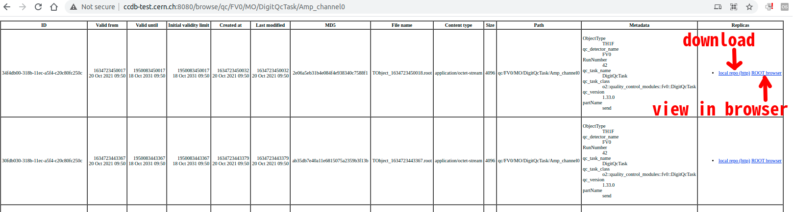
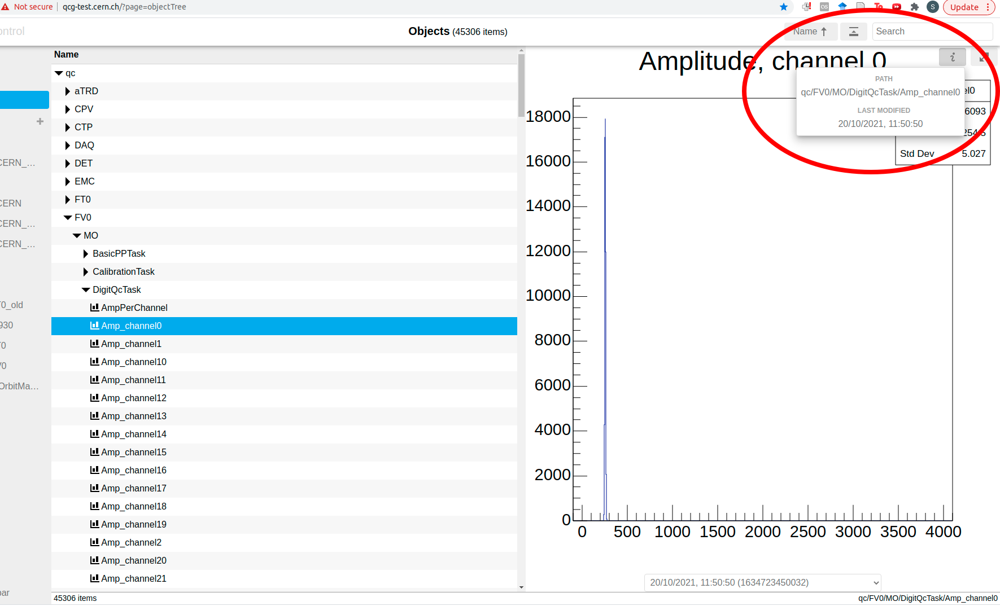
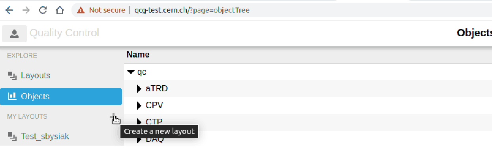
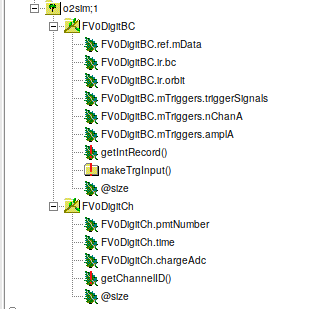
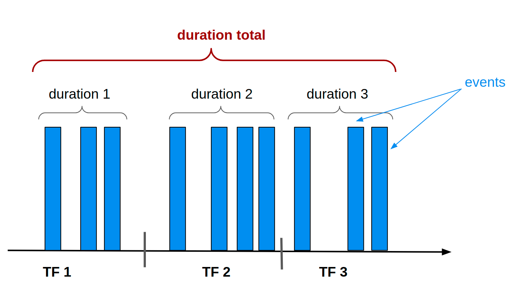

* [For users](#for-users)
   * [QCG, QCDB and CCDB](#qcg-qcdb-and-ccdb)
      * [Links](links)
      * [Accessing objects in QCDB](#accessing-objects-in-qcdb)
      * [Layouts](#layouts)
   * [Other useful links](#other-useful-links)

* [FIT data structure](#fit-data-structure)
   * [Digits](#digits)
* [QC framework structure](#qc-framework-structure)
   * [QcTasks](#qctasks)
   * [PostProcessingTasks](#postprocessingtasks)
   * [Checkers](#checkers)
* [FIT QC tasks](#fit-qc-tasks)
    * [Note on Trigger Rates](#note-on-trigger-rates)
* [Exemplary commands](#exemplary-commands)
    * [Simulation and digitization of data](#simulation-and-digitization-of-data)
    * [Running QC](#running-qc)
    * [Accessing data from EOS](#accessing-data-from-eos)
    * [Converting compressed timeframes CTF](#converting-compressed-timeframes-ctf)
* [Time Calibration workflow](#time-calibration-workflow)
    * [Running the workflows for FT0/FV0](#running-the-workflows-for-ft0-and-fv0)
    * [Running calibration QC for FT0/FV0](#running-calibration-qc-for-ft0-and-fv0)
    * [Related classes are in O2](#related-classes-are-in-o2)
    * [Configuration options](#configuration-options)
* [How to create and use workflows](#how-to-create-and-use-workflows)
    * [The ControlWorkflows](#the-controlworkflows)
    * [The ECS site](#the-ecs-site)
    * [An example: FV0 laser QC](#an-example-fv0-laser-qc)
* [TODO List](#todo-list)

# For users

## QCG, QCDB and CCDB

QCG = QC GUI  
QCDB = database containing QC objects, i.e. Monitoring Objects (MO) and Quality Objects (QO)  
CCDB = Conditions and Calibration DB

### Links
* test databases:

  * test **QCG**: https://qcg-test.cern.ch/?page=objectTree
  * test **CCDB/QCDB**: http://ccdb-test.cern.ch:8080/ ( or http://ccdb-test.cern.ch:8080/browse/  to see directory tree)

* production databases:
  * **QCG:** https://ali-qcg.cern.ch/?page=objectTree
  * **QCDB:** http://ali-qcdb.cern.ch:8083/
  * **CCDB:** http://alice-ccdb.cern.ch/

### Accessing objects in QCDB
For example to see instances of object called `Amp_channel0` created by `FV0::DigitQcTask` go to:  
http://ccdb-test.cern.ch:8080/browse/qc/FV0/MO/DigitQcTask/Amp_channel0

One can find the path to the object by clicking *`i`* icon in qcg 

### Layouts
Layouts are used to create interactive dashboards containing several plots and organized in desired way. They are created in simple drag-and-drop manner. Layouts contain tabs, one can also specify certain plotting options for each object.
One can create new layout by clicking `+` on the left panel in qcg:

Request to support config files for layouts is pending: https://alice.its.cern.ch/jira/browse/OGUI-890.

## Other useful links

* QC repo: https://github.com/AliceO2Group/QualityControl
* documentation for shifters: https://alice-qc-shifter.docs.cern.ch/
* accessing GPN protected websites from outside of CERN: https://gitlab.cern.ch/bvonhall/dynamic-forwarding/-/blob/master/README.md

-------------------------------

# FIT data structure:

## Digits
So far all FIT QC process data in `digit` format. The structure is following (for FV0 - FT0 and FDD may slightly differ):

In short, FV0DigitCh contains (channelID, time, charge) for each hit coming from PM and FV0DigitBC contains:
- InteractionRecord, i.e. precise time information via storing Orbit and BC (convertable to nanosec w.r.t certain time 0 by `o2::InteractionRecord::bc2ns`)
- information from TCM: triggerSignals (bit-by-bit info about fired triggers) and several quantities computed on TCM like `nChanA` (number of fired channels on A side), `amplA` (sum of amplitudes on side A **divided by 8**). For FT0 there is also `timeA` (average time on A side) and equivalent fields for C side.

# QC framework structure

QC framework defines 3 main classes described in next sections: QcTasks, PostProcessingTask and Checker, which are base for the code developed by each detector team.

There are two types of QC objects: MonitoringObjects (MO) and QualityObjects (QO).
MO are ROOT objects, typically histograms or graphs. QO are basically numbers specifying quality of given MO (1=Good/2=Medium/3=Bad and 10=Null = the worst). Qos and be [aggregated](https://github.com/AliceO2Group/QualityControl/blob/master/doc/ModulesDevelopment.md#quality-aggregation).

*As of today (15.11.2021), the policy for storage is following: everything is kept for 24h, after that only one version of each MO/QO per RUN is preserved. Trending can be used to keep information about the time evolution with granularity greater than 1/h.*

## QcTasks:
They take as an input all data in form of digits so are able to compute everything. They create and publish MOs.

## PostProcessingTasks:
Take as the input MO and create new MO. They can work asynchronously. Useful if one wants to combine objects from different sources (e.g. BC pattern from CCDB).

Especially useful example of postprocessing provided in Common part is [TrendingTask](https://github.com/AliceO2Group/QualityControl/blob/master/doc/PostProcessing.md#the-trendingtask-class). One can create trending plot for most commonly used quantities (like mean, stddev, entries of histogram) by adding just several lines to the config file.

## Checkers:
Take as the input MO (or list of MOs) and determines its quality encapsulated into QO.

Useful part of the checker is `beautify()` function (called only if the input is single MO). It allows to modify visual aspects of the input MO - one can for instance modify colors to reflect the quality of the object or add `TPaveText`, which will provide a message or instructions for the shifter.

# FIT QC tasks

List of tasks implemented for FIT (FV0 and FT0 for now):
- DigitQcTask -- main QcTasks, dumps to 1- and 2D histograms most of the information available in digits. In particular it generates separately BC-orbit maps for: all events, for each trigger and for each FEE piece (PM and TCM).

- TriggerQcTask -- takes information from PMs and repeats the logic implemented on TCM to validate the triggers

- BasicPPTask -- postprocessing task which computes trigger rates (+ TPofiles for time and amplitude VS channel)

- OutOfBunchCollTask and OutOfBunchCollCheck -- postprocessing that combines BcOrbitMap with the LHC filling scheme (aka BC pattern) and finds the events which are out-of-the-bunch. Checker compares ratio of out-of-the-bunch events to all events with warning/error thresholds.

- CFDEffCheck -- for each channel computes efficiency of getting charge information when time information was available (charge is not available - and set to zero - in case of time miscalibration).

- CalibrationTask and ChannelTimeCalibrationCheck -- check performance of time offset calibration procedure

### Note on Trigger Rates

Trigger rates are computed by taking number of entries in each bin in `qc/FV0/MO/DigitQcTask/Triggers` by cycle duration. Currently the cycle duration is computed using 3 different methods (after tests with real beam one method should be chosen and the rest removed):
1. convert InteractionRecord to nanosec and find its max and min value within one cycle. Then duration = max - min.
2. convert InteractionRecord to nanosec and compute duration (as above) **for each processed timeframe (TF)**. Cycle duration = sum of durations of all TFs.
3. count TFs. Cycle duration = (#TF) * (#orbits per TF) * (orbit duration)

(#orbits per TF) = parameter (128 or 256).  
(orbit duration) = `o2::constants::lhc::LHCOrbitNS` = 88924.596 ns = 88 µs

First method fails if subsampling is used so methods 2. and 3. are prefered (cycle duration is similar as if no subsumpling is used but number of triggers is reduced).

In case of no subsampling there is still small difference between 1. and 2.: the reason is illustrated below: (duration total) is not exactly equal to (duration1+duration2+duration3) due to small spaces between first collision in TF *n+1* and last collision in TF *n*. The difference is small but visible in case of 1 kHz laser.

# Exemplary commands

### Simulation and digitization of data
1. Generate events and transport particles through detectors  
`o2-sim -g pythia6 -e TGeant3 -m FV0 FT0 FDD -j 2 -n 100`
2. Digitize hits only from selected detector (in my case it was FT0)  
`o2-sim-digitizer-workflow --onlyDet FT0 -b`  
Now file ft0digits.root should be generated in current workdir, one can use this file or follow next
steps to get more experiment like data
3. Convert MC digits to RAW data format as in experiment  
`o2-ft0-digi2raw`
4. Convert back RAW data format to digits  
`o2-raw-file-reader-workflow --input-conf FT0raw.cfg | o2-ft0-flp-dpl-workflow -b`

### Running QC

- on digits:  
`o2-fv0-digit-reader-workflow --fv0-digit-infile o2_fv0digits.root | o2-qc --config json:///qc_config.json -b`

- on digits in raw-TF files:  
`o2-raw-tf-reader-workflow --input-data run0504494/ | o2-fv0-digits-writer-workflow --disable-mc -b`

- on RAW in raw-TF files:  
`o2-raw-tf-reader-workflow --raw-only-det FV0 --input-data run0504494/ | o2-fv0-flp-dpl-workflow -b`

### Accessing data from EOS
listing files:  
- `xrdfs root://eosaliceo2.cern.ch ls -l /eos/aliceo2/raw/2021/OCT/505673/`

copying to local:  
- `xrdcp  -r --parallel 4  root://eosaliceo2.cern.ch/////eos/aliceo2/raw/2021/OCT/505673/raw/0640/ ./`

### Converting compressed timeframes CTF

- to digits (for FV0 trigger information may not be filled):  
`o2-ctf-reader-workflow --onlyDet FV0 --ctf-input path/to/o2_ctf_file.root -b --ctf-dict path/to/ctf_dictionary.root | o2-fv0-digits-writer-workflow --disable-mc -b`

- to reco (to be validated):  
`o2-ctf-reader-workflow --onlyDet FV0 --ctf-input path/to/o2_ctf_file.root -b --ctf-dict path/to/ctf_dictionary.root | o2-fv0-digits-writer-workflow --disable-mc -b`

# Time Calibration workflow

Workflow to calibrate the measured time-distributions of particles by FT0/FV0 detectors. The measured time might be shifted with respect to the LHC clock. Calibration workflow produces these correction shifts (offsets) for each detector channel and stores them as ROOT objects (vectors) into CCDB  (http://ccdb-test.cern.ch:8080/browse/FV0/Calibration/ChannelTimeOffset). Later on for calibrating data, these offsets are applied to the incoming data. This procedure is checked by running the QC:

### Running the workflows for FT0 and FV0:

- `o2-ft0-digits-reader-workflow --ft0-digit-infile <path-to-digits-file> | o2-calibration-ft0-tf-processor | o2-calibration-ft0-channel-offset-calibration | o2-calibration-ccdb-populator-workflow`
- `o2-fv0-digit-reader-workflow --fv0-digit-infile <path-to-digits-file> | o2-calibration-fv0-tf-processor | o2-calibration-fv0-channel-offset-calibration | o2-calibration-ccdb-populator-workflow`

### Running calibration QC for FT0 and FV0:

- `o2-ft0-digits-reader-workflow --ft0-digit-infile <digit-root-file> | o2-qc --config json:///$HOME/alice/QualityControl/Modules/FV0/fv0-calibration-config.json -b`
- `o2-fv0-digit-reader-workflow --fv0-digit-infile <digit-root-file> | o2-qc --config json:///$HOME/alice/QualityControl/Modules/FT0/ft0-calibration-config.json -b`

### Related classes are in O2:
O2/Detectors/FIT/FV0/calibration/src/FV0ChannelTimeTimeSlotContainer.cxx (similar for FT0)
- To calculate the offset values (gaus-fit is implemented)
- To find relavent classes for workflows: Check CMakeList.txt & search there for 'o2_add_executable'

for example:  
`o2_add_executable(fv0-channel-offset-calibration
  COMPONENT_NAME calibration
  SOURCES workflow/FV0ChannelTimeCalibration-Workflow.cxx`

### Configuration options:
While running the calibration workflow you can specify following options to have better calibration (add these options after o2-calibration-fv0-channel-offset-calibration ):
- `--tf-per-slot=N` : It will start the calibration after N timeframes are accumulated (N should be such number which can have sufficient data for calibration)
- `--time-calib-fitting-nbins=M` : This option for specifying histogram range for fitting gaussian .i.e M bins per side of the histogram maxima. (This will help to have robust fitting)
- `--updateInterval` : Options available but not used. Check the details here https://github.com/AliceO2Group/AliceO2/tree/dev/Detectors/Calibration#timeslotcalibrationinput-container
- `--max-delay`

# How to create and use workflows

In this section we describe how to create a workflow and how to use it in the [ECS](https://ali-ecs.cern.ch/?page=newEnvironment). As an example, we give the details of the
creation of the FV0 laser QC.

## The ControlWorkflows

First of all, have a local clone from the [ControlWorklows](https://github.com/AliceO2Group/ControlWorkflows) repository. Once it is forked on the site, in bash, it can be cloned with
`git clone https://github.com/AliceO2Group/ControlWorkflows.git` command. I also did `git remote -v` and `git remote add origin git@github.com:<your_git_user_name>/ControlWorkflows`.
May be these are not necessary.

The repository contains a quite extensive README which I recommend to read. Besides, there are the three main directories:
* scripts: this directory contains the scripts which generate the workflows and the `.json` files for the configurations of the workflows in the `scripts/etc` subdirectory. This is where your `.json` files should go.
* tasks: the generation script will produce `.yaml` files that corresponds to your tasks in the `.json` which go here.
* workflows: the generation script will produce `.yaml` file that contains your tasks and goes here.
All you need to do is the followings:
* copy your `.json` file into the `scripts/etc`
* write your on generation script (or just copy and modify an existing one) and run it
* the name of the new workflow also should be added to `workflows/readout-dataflow.yaml` file. Find the group of workflows for your detector and add it there.
* Push the changes into your repository
* write an e-mail to a corresponding person to add your git repository to ECS (when I did this the person was Roberto Divia (Roberto.Divia@cern.ch))
* upload your .json file to [Consul](https://ali-consul-ui.cern.ch/ui/alice-o2-cluster/kv/o2/components/qc/ANY/any/) with the naming convention you find there. E.g. in my case fv0-digits-qc-laser.json transformed to fv0-digits-qc-laser-alio2-cr1-flp180.json. The postfix is related to the FLP version (I think).

## The ECS site

## An example: FV0 laser QC

# TODO List

* conversion of BcOrbitMaps to THnSparse or TH2I or even TH1  
  BcOrbitMaps are large: TH2F with 3564 x 256 bins. After taking first data one can think about changing them to THnSparse (but be careful about merging performance! maybe contact QC experts)  
  On the other hand, LHC filling scheme is basically 1D information, so one could consider dropping orbits completely and only use BC (to be consulted with detector experts).
* add plots with sums of both channels in ring 5 (in each sector), e.g. A51+A52
* add plot with time deltas between channels, filled on event-by-event basis (to estimate time resolution)
* switch to taking BunchFilling from new source: https://alice-talk.web.cern.ch/t/access-to-lhc-filling-scheme/1073/22
* unify settings in TriggerQcTask to be similar to the menu in ControlServer (e.g. thresholds in number of ADC channels VS in MIPs)
